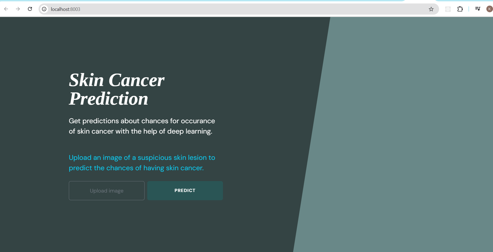
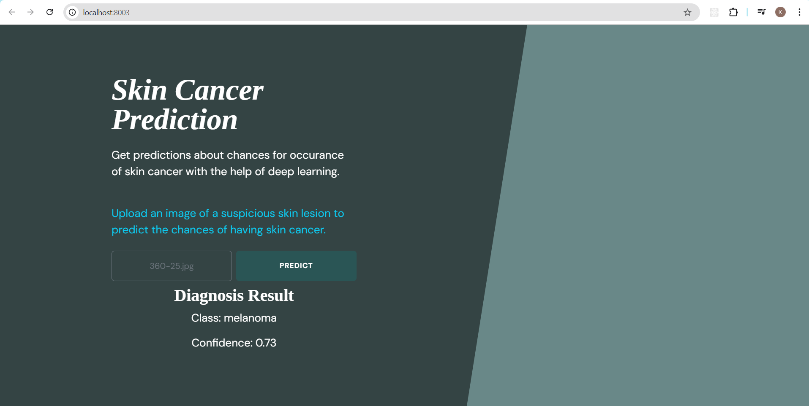

# 🧠 Skin Cancer Prediction App

The **Skin Cancer Prediction App** is a web-based application that leverages machine learning to detect and classify skin lesions. It helps users identify potential skin cancer early, enabling timely medical attention. Users can upload images of skin lesions and receive predictions based on a trained deep learning model.

---



## 🚀 Features

- 📷 Upload skin lesion images for prediction  
- 🩺 Classify lesions as **benign** or **malignant**  
- 📊 View detailed prediction results with confidence scores  

---

## 🛠️ Installation

### 1. Clone the repository

```bash
git clone https://github.com/kavyathacharath/skin-cancer-prediction-app.git
cd skin-cancer-prediction-app
